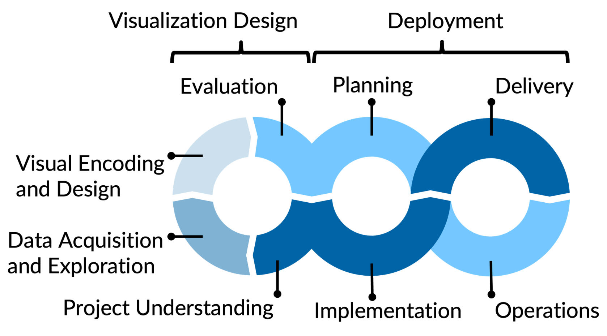

# Zurich Traffic Accident Visualization Dashboard

This repository contains a data visualization project based on police-recorded road traffic accidents in the Canton of Zurich. The project analyzes accident patterns from 2011 to 2025 and communicates the results through an interactive Streamlit dashboard and a Quarto documentation website.

The dashboard helps users explore:

- accident trends over time
- monthly and weekday-hour patterns
- accident types and vulnerable road user involvement
- accident severity by road type
- spatial accident hotspots based on CHLV95 coordinates

The project is developed as part of a data visualization course and emphasizes reproducibility, traceability and clear visual communication.

## Project Organisation

The visualization product development is organised according to the following process model:



Code and configurations used in the different project phases are stored in the corresponding subfolders. Documentation artefacts are provided as a Quarto project in `docs`.

| Phase | Code folders / files | Documentation section | `docs` file |
|:---|:---|:---|:---|
| Project Understanding | - | Project Charta | `project_charta.qmd` |
| Data Acquisition and Exploration | `data_acquisition/Data_analysis` | Data Report | `data_report.qmd` |
| Visual Encoding and Design | `data_acquisition/viz_design` | Visualization Design Report | `viz_design_report.qmd` |
| Dashboard Implementation | `app/streamlit_app.py` | Deployment | `deployment.qmd` |
| Evaluation | - | Evaluation Report | `evaluation_report.qmd` |
| Deployment | `app`, `.github/workflows` | Deployment | `deployment.qmd` |

Important project files:

```text
app/streamlit_app.py
data_acquisition/Raw/traffic_accidents_zh_2011_2025.csv
data_acquisition/Processed/traffic_accidents_zh_clean.csv
data_acquisition/Data_analysis/01_data_exploration.ipynb
data_acquisition/viz_design/01_visualizations.ipynb
docs/project_charta.qmd
docs/data_report.qmd
docs/viz_design_report.qmd
docs/evaluation_report.qmd
docs/deployment.qmd
```

The final visualization product is the Streamlit dashboard. The Quarto website contains the project documentation, data report, visualization design report, evaluation report and deployment documentation.

## Data

The raw dataset is the public open government dataset:

*Polizeilich registrierte Verkehrsunfälle im Kanton Zürich seit 2011*

The raw CSV file is stored in:

```text
data_acquisition/Raw/traffic_accidents_zh_2011_2025.csv
```

The processed dataset used by the dashboard is stored in:

```text
data_acquisition/Processed/traffic_accidents_zh_clean.csv
```

The processed dataset can be recreated by running:

```text
data_acquisition/Data_analysis/01_data_exploration.ipynb
```

## Streamlit Dashboard

The dashboard code is located in:

```text
app/streamlit_app.py
```

To run the dashboard locally:

```bash
streamlit run app/streamlit_app.py
```

If Streamlit is not installed yet:

```bash
pip install streamlit pandas numpy plotly matplotlib
```

The dashboard reads the processed dataset from:

```text
data_acquisition/Processed/traffic_accidents_zh_clean.csv
```

## Python Environment Setup and Management with uv

Make sure to have `uv` installed:

```text
https://docs.astral.sh/uv/getting-started/installation/
```

After cloning the repository, create the Python environment with all dependencies based on the `.python-version`, `pyproject.toml` and `uv.lock` files by running:

```bash
uv sync
```

To add new dependencies, use:

```bash
uv add <package>
```

For example:

```bash
uv add streamlit plotly pandas numpy matplotlib
```

Remove packages with:

```bash
uv remove <package>
```

Commit changes to `pyproject.toml` and `uv.lock` into version control.

Run `uv sync` after pulling changes to update the local environment.

Whenever the Python environment is used, commands can be prefixed with:

```bash
uv run
```

Example:

```bash
uv run python script.py
```

You can also activate the project Python environment in a terminal session:

```bash
source .venv/bin/activate
```

## Runtime Configuration with Environment Variables

The repository may contain an `.env.template` file to demonstrate how environment variables are specified. A local `.env` file should not be committed into version control, because it may contain secrets.

For this project, no external API keys are required for the main dashboard. The dashboard runs from local CSV data.

## Quarto Setup and Usage

### Setup Quarto

1. Install Quarto:  
   `https://quarto.org/docs/get-started/`

2. Optional: install the Quarto extension for VS Code.

3. If working with SVG files and PDF output, install `rsvg-convert`:
   - macOS: `brew install librsvg`
   - Windows with Chocolatey: `choco install rsvg-convert`

Source `.qmd` and configuration files are in the `docs` folder. The Quarto project configuration is in:

```text
docs/_quarto.yml
```

### Rendering the Documentation

From the project root, render the documentation with:

```bash
quarto render docs
```

On Alessandro's local machine, Quarto previously had to be forced to use Python 3.12:

```bash
export QUARTO_PYTHON=/Library/Frameworks/Python.framework/Versions/3.12/bin/python3
quarto render docs
```

To preview locally:

```bash
export QUARTO_PYTHON=/Library/Frameworks/Python.framework/Versions/3.12/bin/python3
quarto preview docs --no-browser --no-watch-inputs
```

If Quarto reports missing Python modules such as `yaml` or `jupyter`, install the required packages into the Python version used by Quarto:

```bash
/Library/Frameworks/Python.framework/Versions/3.12/bin/python3 -m pip install jupyter pyyaml pandas plotly matplotlib numpy
```

### Working on the Documentation

1. Make changes to the `.qmd` source files in the `docs` folder.
2. Make sure the correct Python environment is available.
3. Preview locally with:

```bash
quarto preview docs
```

4. Build the documentation website with:

```bash
quarto render docs
```

5. Check the generated website locally in the output folder configured in `docs/_quarto.yml`.

## Deployment

The project has two deployment targets:

1. **Quarto documentation website**  
   Published via GitHub Pages.

2. **Streamlit dashboard**  
   Published via Streamlit Community Cloud or run locally from `app/streamlit_app.py`.

The Quarto documentation explains the project context, data processing, visualization design, evaluation and deployment. The Streamlit dashboard is the interactive visualization product.

## GitHub Pages Deployment

The documentation website can be deployed to GitHub Pages via a GitHub Actions workflow.

Recommended setup:

1. In the GitHub repository settings, go to **Settings > Pages**.
2. Set the source to **GitHub Actions**.
3. Render the Quarto project locally.
4. Commit and push the updated documentation files.
5. GitHub Actions builds and publishes the website.

If the project uses Quarto freeze, cached execution results should be committed so that GitHub Actions can deploy the website reproducibly.

## Streamlit Deployment

To deploy the dashboard on Streamlit Community Cloud:

1. Push the repository to GitHub.
2. Open Streamlit Community Cloud.
3. Create a new app from the GitHub repository.
4. Set the main file path to:

```text
app/streamlit_app.py
```

5. Make sure the repository contains the processed CSV file:

```text
data_acquisition/Processed/traffic_accidents_zh_clean.csv
```

6. Make sure dependencies are listed in `requirements.txt` or `pyproject.toml`.

A minimal `requirements.txt` should include:

```text
streamlit
pandas
numpy
plotly
matplotlib
```

## Reproducibility

The project is reproducible because:

- the raw dataset location is documented
- the processed dataset is created from a documented notebook
- the dashboard reads from the processed CSV file
- static prototype figures are generated in a notebook
- the Quarto documentation describes the data, design and evaluation process
- all code is stored in the GitHub repository

## Team

The project is developed by:

- Thomas — data analysis and exploratory data analysis
- Alessandro — data cleaning, preprocessing and documentation
- Neil — visualization design and dashboard integration