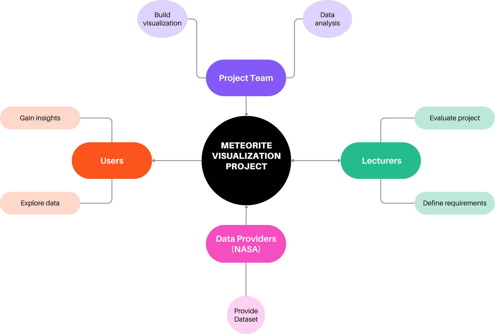

# Project Charta
## Context and Scope
Meteorites are fragments of asteroids or other celestial bodies that reach the Earth’s surface. Studying them can provide useful information about the composition and history of our solar system. The NASA Meteorite Landings dataset contains records of meteorites that have been found or observed falling in different parts of the world. The dataset includes information such as the meteorite name, class, mass, year of discovery, and geographic coordinates.

The aim of this project is to analyze this dataset and communicate the most interesting patterns through clear and effective visualizations. In particular, the project will explore how meteorite discoveries are distributed across different regions of the world and how the number of recorded meteorites has changed over time. It will also look at characteristics such as meteorite mass and classification.

The project will try to answer questions such as: Where are meteorites most commonly found? How has the number of discoveries evolved over the years? Are certain types of meteorites more common than others?

The final visualization product will be published as a GitHub Pages website generated from the project’s Quarto repository, where the analysis, visualizations, and documentation will be available.

## Project Objectives and Success Criteria

The project's primary objective is to help users discover and understand patterns in global meteorite landings through clear and interactive visualizations. Users should be able to explore how meteorite landings are distributed geographically, how they have changed over time, and which physical characteristics (e.g., mass, classification) are most relevant.

The final product aims to provide clarity, simplicity, and reproducibility of the presented information for stakeholders (such as lecturers and exploratory data analysts). All results should be traceable back to the project repository, ensuring transparent data processing.

### Success Criteria

#### Qualitative Criteria
- The visualization enables users to understand the global distribution of meteorite landings.
- Users can identify periods of higher and lower meteorite occurrences over time.
- The interface is intuitive and usable for users with low to moderate data literacy.
- The visualization communicates insights effectively without requiring technical expertise.

#### Quantitative Criteria

- Users can identify the three regions with the highest meteorite density within 10 seconds.
- At least three different visualizations are provided.
- At least 80% of test users correctly answer predefined analytical questions.
- The project is fully reproducible, with data cleaning and processing documented in the repository.
- The visualization is successfully published via GitHub Pages and loads within three seconds on a standard computer.

### Out of Scope

- No predictive modelling or real-time data integration.
- Focus on desktop use only (no mobile optimization).
- No scientific interpretation beyond exploratory analysis.

## Stakeholder Analysis

The project involves several stakeholders with different roles and expectations:

- **Lecturers (primary stakeholders)**  
  Evaluate the project and expect a clear, well-structured, and reproducible data visualization product.

- **Students / Project team (developers)**  
  Responsible for data analysis, visualization design, and implementation of the final product.

- **General users (e.g., students, data enthusiasts)**  
  Use the visualization to explore meteorite data and gain insights in an intuitive way.

- **Scientific community / data providers (indirect stakeholders)**  
  Provide the dataset and benefit from correct representation and interpretation of the data.

These stakeholders are connected through the visualization product: the project team develops it, lecturers evaluate it, and users interact with it to gain insights.

{#fig-project-overview}

## User Analysis

### Persona 1: Laura Bianchi
::: {.grid}
::: {.g-col-8}
**Name:** Laura Bianchi  
**Age:** 24  
**Role:** Data science student  
**Domain expertise:** Medium (basic knowledge of data analysis and statistics)  
**Data literacy:** Medium–high  
**Technical environment:** Laptop (13–15”), uses Python, Jupyter, web dashboards  
**Frequency of use:** Weekly (for assignments/projects)  
:::

::: {.g-col-4}
{width=65%}
:::
:::
**User tasks (jobs):**  
Laura aims to use the visualization as a tool to explore and analyse patterns in meteorite landings for her coursework. She is interested in identifying trends over time and comparing meteorite characteristics such as mass and classification. Through the interactive visualizations, she aims to support her academic work, including assignments and presentations, by extracting meaningful insights from the dataset in a more efficient and intuitive way than working with raw data alone.

**Pains:**  
- Raw dataset is large and difficult to interpret (thousands of records)  
- Hard to identify trends without visualization  
- Geographic patterns are not obvious in tabular data  

**Gains:**  
- Clear visualizations showing trends over time (e.g. increase in discoveries)  
- Interactive map to explore meteorite locations worldwide  
- Ability to filter data by year, type, or mass for deeper analysis  

---

### Persona 2: Johannes Schmidt
::: {.grid}
::: {.g-col-8}
**Name:** Johannes Schmidt  
**Age:** 72  
**Role:** Curious non-expert user  
**Domain expertise:** Low (no background in astronomy or data analysis)  
**Data literacy:** Low–medium  
**Technical environment:** Laptop or mobile device  
**Frequency of use:** Occasional (browsing or curiosity-driven)  
:::

::: {.g-col-4}
{width=65%}
:::
:::
**User tasks (jobs):**  
Johannes aims to use the visualization to satisfy his curiosity about meteorites in an easy and engaging way. He wants to quickly understand where meteorites are commonly found and discover interesting patterns without needing technical knowledge. The visualization helps him gain a general overview of the data and learn new facts through simple, visually appealing representations that require minimal effort to interpret.

**Pains:**  
- Complex charts are confusing or intimidating  
- Too much technical detail reduces engagement  
- Difficult to interpret scientific datasets  

**Gains:**  
- Simple and intuitive visualizations (especially maps and clear charts)  
- Short explanations highlighting key insights  
- Visually engaging and interactive interface that encourages exploration

_The persona images used in this document are illustrative only and were generated with ChatGPT to visually support the persona descriptions._

## Situation Assessment
The project is based on the NASA Meteorite Landings dataset, which contains records of meteorites found or observed falling on Earth. The dataset includes information such as meteorite name, classification, mass, year of discovery, and geographic coordinates. It meets the project requirements by providing more than 100 observations and a mix of numerical and categorical variables.

The project will be developed by the project team (Thomas, Ale, Neil). Collaboration and version control will be managed through a shared GitHub repository, which will also contain the documentation and reproducible analysis.

The analysis and visualizations will be created using Python and the tools introduced in the course, while the documentation will be written as a Quarto project and published online using GitHub Pages. These tools ensure transparency, reproducibility, and accessibility of the results.

The main constraint of the project is the limited timeframe of the course, which requires the analysis, visualization design, and documentation to be completed within the semester. Another limitation is that the dataset is historical and observational, meaning that some records may contain missing values or inconsistencies.

Possible risks include data quality issues (such as incomplete or inconsistent records), technical challenges during the development of visualizations, and coordination challenges within the team. These risks will be addressed through data cleaning, regular collaboration within the team, and the use of version control through GitHub.

## Visualization Concept

The proposed visualization product is designed to address the needs of both primary and secondary users identified in the user analysis, particularly a data-aware student (Laura) and a non-expert curious user (Johannes).

**Product form:**
The final product will be an interactive web-based dashboard developed in Quarto and published via GitHub Pages. The dashboard allows both exploration and guided understanding of meteorite data.

**Visual encodings:**
- A world map to display the geographic distribution of meteorite landings
- A line chart to show the number of meteorites discovered over time
- A bar chart to compare meteorite classes
- A scatter plot to analyze the relationship between mass and year

**Interactivity:**
- Filters by year range and meteorite class
- Hover tooltips with detailed information (name, mass, year, location)
- Zoom and pan functionality on the map
- Linked views (e.g. filtering updates multiple charts)

**Narrative and annotation:**
Short textual explanations will guide users through key findings (e.g. trends over time or concentration in specific regions). Important insights will be highlighted using annotations.

**Target medium and integration:**
The visualization will be embedded in a web-based Quarto project and published as a GitHub Pages website, making it accessible to a wide audience.

---

### Value

**Cognitive and analytical value:**
The combination of map and charts allows users to quickly identify spatial patterns, temporal trends, and relationships between variables. Interactivity supports deeper exploration and comparison.

**Communicative value:**
Clear visual structure and simple chart types ensure that both expert and non-expert users can understand the key insights without needing to interpret raw data tables.

**Experiential and aesthetic value:**
An interactive and visually clean design increases engagement and encourages users to explore the data. Simple navigation and intuitive controls build trust and usability.

---

The concept directly addresses user needs by simplifying complex data (reducing pains), enabling exploration (supporting jobs), and providing clear and engaging insights (creating gains).

---

## Project Plan

The project is divided into four main phases aligned with the course deadlines:

**Project Understanding:**  
Definition of the project scope, stakeholder and user analysis, and completion of the project charta before the draft submission.

**Data Acquisition and Exploration:**  
Collection, cleaning, and exploration of the meteorite dataset to identify relevant variables and patterns.

**Visualization Design:**  
Development of visualizations and dashboard components, including maps and charts, aligned with intermediate assignments.

**Evaluation and Delivery:**  
Refinement of the visualization product, preparation of the final presentation, and final submission.

```{mermaid}
%%| label: fig-project-plan
%%| fig-cap: Preliminary project plan in the form of a Gantt chart.
gantt
    title Project Plan
    dateFormat YYYY-MM-DD
    axisFormat %d/%m
    tickInterval 2week

    section Project Understanding
        Context, stakeholder & user analysis :a1, 2026-03-05, 5d
        Project charta draft : milestone, m1, 2026-03-20, 1d

    section Data Acquisition and Exploration
        Data collection and cleaning :a2, 2026-03-20, 5d
        Exploratory data analysis :a3, 2026-03-25, 5d

    section Visualization Design
        Simple text & tables assignment : milestone, m2, 2026-03-18, 1d
        Visual variables assignment : milestone, m3, 2026-03-30, 1d
        Directory of visualizations : milestone, m4, 2026-04-13, 1d
        Design task (Gestalt & interaction) : milestone, m5, 2026-04-30, 1d
        Dashboard development :a4, 2026-04-01, 20d

    section Evaluation and Delivery
        Draft presentation : milestone, m6, 2026-05-18, 1d
        Final project refinement :a5, 2026-05-18, 10d
        Final submission : milestone, m7, 2026-06-01, 1d
```

See [Mermaid syntax for Gantt charts](https://mermaid.js.org/syntax/gantt.html). It might not be displayed correctly in Safari &#8594; use Chrome. [Live editor with export functionality](https://mermaid.live/)

## Roles and Contact Details

The project is developed by the three team members:

- **Thomas** – Data analysis and exploratory data analysis  
  Tasks: data inspection, variable selection, support for interpretation of the dataset  
  Contact: martith5@students.zhaw.ch

- **Alessandro** – Data cleaning, preprocessing and documentation  
  Tasks: data preparation, reproducibility, Quarto documentation, repository organization  
  Contact: pucinale@students.zhaw.ch

- **Neil** – Visualization design and dashboard integration  
  Tasks: chart design, map implementation, dashboard layout, GitHub Pages publication  
  Contact: schranei@students.zhaw.ch