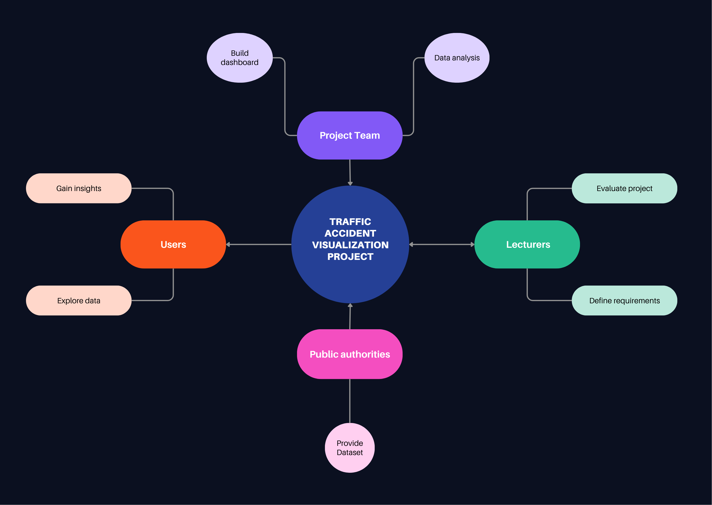

# Project Charta

## Context and Scope

Road traffic accidents are an important public safety issue, as they affect mobility, urban planning, insurance risk, and the daily lives of citizens. Understanding when, where, and under which conditions accidents occur can support safer transport systems and help communicate relevant patterns to both expert and non-expert audiences. The dataset *Polizeilich registrierte Verkehrsunfälle im Kanton Zürich seit 2011* contains police-recorded road traffic accidents in the Canton of Zurich since 2011. It includes variables such as accident type, severity category, road type, involvement of pedestrians, bicycles and motorcycles, time information, and accident location coordinates.

The aim of this project is to analyze this dataset and communicate relevant accident patterns through clear and effective visualizations. In particular, the project explores how traffic accidents are distributed across the canton, how accident frequency changes over time, which accident types are most common, when accidents occur during the week, how vulnerable road users are involved, and how accident severity differs across road types. The project also includes a spatial hotspot view based on accident coordinates.

The project will try to answer questions such as: Where do traffic accidents concentrate in the Canton of Zurich? How has the number of recorded accidents changed over time? When do accidents peak during the week? Which vulnerable road users are involved in which accident types? How does severity differ by road type? Which areas or conditions may be relevant for traffic safety planning or insurance risk analysis?

The final visualization product will be an interactive Streamlit dashboard. The project documentation, data processing, design rationale and supporting reports will be published as a GitHub Pages website generated from the project’s Quarto repository.

## Project Objectives and Success Criteria

The project's primary objective is to help users discover and understand patterns in road traffic accidents in the Canton of Zurich through a clear and interactive dashboard. Users should be able to understand how accidents are distributed geographically, how accident counts vary over time, when accidents occur during the week, how vulnerable road users are involved, which accident types are frequent, and how accident severity differs across road types.

The final product aims to provide clarity, usability, and reproducibility for stakeholders such as lecturers, traffic safety planners, insurance risk analysts, and exploratory data users. All results should be traceable back to the project repository, ensuring transparent data processing.

### Success Criteria

#### Qualitative Criteria

- The dashboard enables users to understand the geographic distribution of traffic accidents in the Canton of Zurich.
- Users can identify periods of higher and lower accident frequency over time.
- Users can understand recurring weekday-hour patterns in accident frequency.
- Users can compare vulnerable road user involvement and frequent accident types.
- Users can understand the distribution of accident severity by road type.
- The interface is intuitive and usable for users with moderate data literacy.
- The visualization communicates accident patterns effectively without requiring users to inspect the raw dataset.

#### Quantitative Criteria

- Users can identify the main spatial hotspot area within 10 seconds.
- At least six different visualization views are provided.
- At least 80% of test users correctly answer predefined analytical questions.
- The project is fully reproducible, with data cleaning and processing documented in the repository.
- The visualization product is published online and loads within three seconds on a standard computer.

### Out of Scope

- No predictive modelling or real-time accident monitoring.
- No causal claims about why accidents happen beyond exploratory analysis.
- No real-time data integration.
- No official operational recommendation for police deployment, speed controls or insurance pricing.
- No mobile optimization beyond basic browser accessibility.
- No conversion of CHLV95 coordinates into a full geographic basemap unless time allows.

## Stakeholder Analysis

The project involves several stakeholders with different roles and expectations:

- **Lecturers (primary stakeholders)**  
  Evaluate the project and expect a clear, well-structured, reproducible and well-documented data visualization product.

- **Students / Project team (developers)**  
  Responsible for data acquisition, data cleaning, exploratory analysis, visualization design, dashboard implementation and documentation.

- **Traffic safety planners / police decision-makers**  
  Use the dashboard to explore accident hotspots, time patterns, severity patterns and vulnerable road user involvement.

- **Insurance risk analysts**  
  Use the dashboard to explore accident exposure, frequent accident types, severity patterns and spatial concentrations.

- **Public authorities / data providers (indirect stakeholders)**  
  Provide the dataset and benefit from correct representation and interpretation of public accident data.

These stakeholders are connected through the visualization product: the project team develops it, lecturers evaluate it, and applied users can use it to explore accident patterns and support evidence-based discussions.

{#fig-project-overview}

## User Analysis

### Persona 1: Laura Bianchi

::: {.grid}
::: {.g-col-8}
**Name:** Laura Bianchi  
**Age:** 46  
**Role:** Head of traffic police operations  
**Domain expertise:** High (traffic safety, road monitoring and operational planning)  
**Data literacy:** Medium (uses reports, maps and operational dashboards)  
**Technical environment:** Desktop computer at work, laptop during coordination meetings  
**Frequency of use:** Weekly or before planning meetings  
:::

::: {.g-col-4}
{width=65%}
:::
:::

**User tasks (jobs):**  
Laura aims to use the dashboard to support traffic safety planning in the Canton of Zurich. She wants to identify where accidents concentrate, when accident frequency is highest, and which road types show more severe outcomes. The spatial hotspot view helps her understand where monitoring, patrol presence or speed-control discussions may be most relevant. The time-based views help her compare accident pressure across years, months, weekdays and hours, while the severity and road-user charts support decisions about targeted prevention measures.

**Pains:**  

- Accident data is large and difficult to translate into operational priorities.
- It is hard to compare accident hotspots, time patterns and severity levels from tables alone.
- Planning controls or patrol presence requires quick evidence about where and when accidents concentrate.
- Rare but severe outcomes can be hidden when only total accident counts are considered.

**Gains:**  

- Clear overview of accident trends, hotspots and peak time windows.
- Ability to compare severity by road type for safety planning discussions.
- Faster identification of locations and periods that may need more monitoring or prevention measures.
- Evidence-based support for internal communication and planning meetings.

---

### Persona 2: Johannes Schmidt

::: {.grid}
::: {.g-col-8}
**Name:** Johannes Schmidt  
**Age:** 52  
**Role:** Insurance risk analyst  
**Domain expertise:** Medium–high (risk assessment, claims analysis and portfolio monitoring)  
**Data literacy:** High  
**Technical environment:** Desktop computer, business intelligence tools, spreadsheets and web dashboards  
**Frequency of use:** Monthly or during risk review cycles  
:::

::: {.g-col-4}
{width=65%}
:::
:::

**User tasks (jobs):**  
Johannes aims to use the dashboard to explore accident exposure in the Canton of Zurich from an insurance risk perspective. He wants to understand where accidents are concentrated, which accident types occur most frequently, how vulnerable road users are involved, and how severity differs across road types. The dashboard helps him compare accident patterns across time, location and severity without working directly with the raw dataset. This supports exploratory risk assessment, internal reporting and discussions about areas or conditions with higher accident exposure.

**Pains:**  

- Raw accident records are too detailed for quick portfolio-level interpretation.
- Spatial concentration and severity patterns are difficult to assess without visual aggregation.
- Accident type and road-user involvement patterns are hard to compare from raw tables.
- Risk discussions require concise visual evidence rather than long data extracts.

**Gains:**  

- Quick identification of accident concentrations and high-exposure areas.
- Clear comparison of accident types and vulnerable road user involvement.
- Better understanding of severity composition across road types.
- Visual material that can support internal risk reviews and reporting.

---

_The persona images used in this document are illustrative only and were generated with ChatGPT to visually support the persona descriptions._

## Situation Assessment

The project is based on the dataset *Polizeilich registrierte Verkehrsunfälle im Kanton Zürich seit 2011*, which contains police-recorded road traffic accidents in the Canton of Zurich. The dataset includes information such as accident type, severity category, road type, year, month, weekday, hour, involvement of pedestrians, bicycles and motorcycles, municipality codes, and geographic coordinates. It meets the project requirements by providing substantially more than 100 observations and a rich combination of numerical, categorical, and boolean variables.

The project will be developed by the project team (Thomas, Ale, Neil). Collaboration and version control will be managed through a shared GitHub repository, which will also contain the documentation and reproducible analysis.

The data processing and visualizations will be created using Python. The final dashboard will be implemented with Streamlit, while the documentation will be written as a Quarto project and published online using GitHub Pages. These tools ensure transparency, reproducibility, and accessibility of the results.

The main constraint of the project is the limited timeframe of the course, which requires the analysis, visualization design, dashboard implementation, and documentation to be completed within the semester. Another limitation is that the dataset is observational and administrative, meaning that some records may contain missing values, inconsistent categories across time, or limited contextual information about accident causes.

Possible risks include data quality issues such as incomplete time information or category handling, technical challenges during the development of spatial visualizations, and coordination challenges within the team. These risks will be addressed through data cleaning, regular collaboration within the team, and the use of version control through GitHub.

## Visualization Concept

The proposed visualization product is designed to address the needs of the applied user groups identified in the user analysis, particularly a traffic police decision-maker (Laura) and an insurance risk analyst (Johannes).

**Product form:**  
The final product will be an interactive Streamlit dashboard. The dashboard allows users to filter the accident data by year range, severity category, road type, accident type and vulnerable road user involvement. Supporting documentation will be embedded in the Quarto project and published via GitHub Pages.

**Visual encodings:**  

- A line chart to show the number of accidents over time.
- A monthly drill-down chart to show seasonal patterns for a selected year.
- A heatmap to analyze accident frequency by weekday and hour.
- A bar chart to compare accidents involving pedestrians, bicycles and motorcycles.
- A stacked horizontal bar chart to compare accident types by vulnerable road user group.
- A stacked bar chart to compare accident severity by road type.
- A spatial hotspot view to display accident concentrations using CHLV95 coordinates.

**Interactivity:**  

- Filters by year range, severity category, road type and accident type.
- Filter by vulnerable road user involvement.
- Hover tooltips for detailed values.
- A monthly drill-down year selector.
- Legend-based selection in stacked charts.
- Zooming in the spatial hotspot view.
- Multi-select focus options for hotspot categories such as severe injuries, fatal accidents, pedestrian involvement, bicycle involvement and motorcycle involvement.

**Narrative and annotation:**  
Short textual explanations guide users through the dashboard sections. The dashboard starts with overall accident volume, then moves to time patterns, vulnerable road users, accident types, severity by road type and spatial hotspots. The goal is to support fast interpretation without overloading the interface with long explanatory text.

**Target medium and integration:**  
The visualization product will be made available online as a Streamlit dashboard. The project documentation, data report, design report and evaluation report will be published as a web-based Quarto project via GitHub Pages.

---

### Value

**Cognitive and analytical value:**  
The combination of filters and charts allows users to identify spatial patterns, temporal trends, accident type distributions, vulnerable road user involvement and severity differences. The dashboard supports exploratory analysis while keeping the visual structure simple.

**Communicative value:**  
Clear titles, concise descriptions and familiar chart types help users understand key accident patterns without needing to inspect raw data tables. This supports both internal project communication and applied decision-oriented discussions.

**Experiential and aesthetic value:**  
A consistent dark visual style, readable labels, hover information and structured sections make the dashboard engaging and usable. The interface supports exploration while remaining focused on the main analytical questions.

---

The concept directly addresses user needs by simplifying complex data, reducing the effort required to find relevant patterns, enabling focused exploration, and providing clear visual evidence for planning and risk analysis discussions.

---

## Project Plan

The project is divided into four main phases aligned with the course deadlines:

**Project Understanding:**  
Definition of the project scope, stakeholder and user analysis, and completion of the project charta before the draft submission.

**Data Acquisition and Exploration:**  
Collection, cleaning, and exploration of the traffic accident dataset to identify relevant variables and patterns.

**Visualization Design:**  
Development of visualizations and the dashboard structure, including temporal charts, categorical charts, severity views and spatial hotspot views, aligned with intermediate assignments.

**Evaluation and Delivery:**  
Refinement of the visualization product, preparation of the final presentation, online publication, and final submission.

```{mermaid}
%%| label: fig-project-plan
%%| fig-cap: Preliminary project plan in the form of a Gantt chart.
gantt
    title Project Plan
    dateFormat YYYY-MM-DD
    axisFormat %d/%m
    tickInterval 2week

    section Project Understanding
        Context, stakeholder & user analysis :a1, 2026-03-05, 5d
        Project charta draft : milestone, m1, 2026-03-20, 1d

    section Data Acquisition and Exploration
        Data collection and cleaning :a2, 2026-03-20, 5d
        Exploratory data analysis :a3, 2026-03-25, 5d

    section Visualization Design
        Simple text & tables assignment : milestone, m2, 2026-03-18, 1d
        Visual variables assignment : milestone, m3, 2026-03-30, 1d
        Directory of visualizations : milestone, m4, 2026-04-13, 1d
        Design task (Gestalt & interaction) : milestone, m5, 2026-04-30, 1d
        Dashboard development :a4, 2026-04-01, 20d

    section Evaluation and Delivery
        Draft presentation : milestone, m6, 2026-05-18, 1d
        Final project refinement :a5, 2026-05-18, 10d
        Final submission : milestone, m7, 2026-06-01, 1d
```

See [Mermaid syntax for Gantt charts](https://mermaid.js.org/syntax/gantt.html). It might not be displayed correctly in Safari &#8594; use Chrome. [Live editor with export functionality](https://mermaid.live/)

## Use of AI Tools

During the project, ChatGPT was used as a supporting tool for brainstorming, wording, code debugging, dashboard refinement, and documentation editing. The project team remained responsible for all final decisions, data processing, visualization design, code implementation, interpretation of results, and submitted content.

## Roles and Contact Details

The project is developed by the three team members:

- **Thomas** – Data analysis and exploratory data analysis  
  Tasks: data inspection, variable selection, support for interpretation of the dataset  
  Contact: martith5@students.zhaw.ch

- **Alessandro** – Data cleaning, preprocessing and documentation  
  Tasks: data preparation, reproducibility, Quarto documentation, repository organization  
  Contact: pucinale@students.zhaw.ch

- **Neil** – Visualization design and dashboard integration  
  Tasks: chart design, dashboard layout, Streamlit implementation, GitHub Pages documentation support  
  Contact: schranei@students.zhaw.ch
