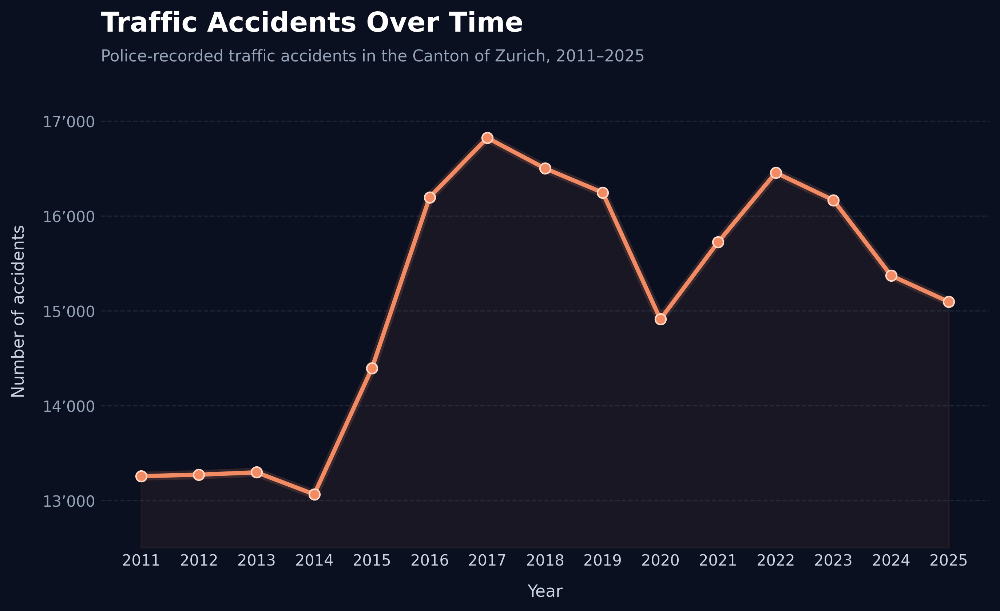
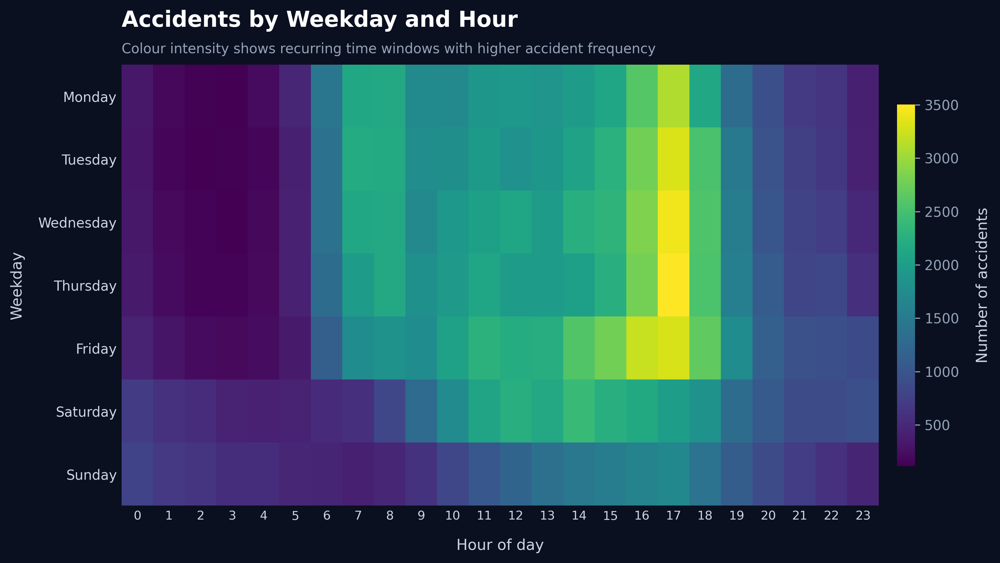
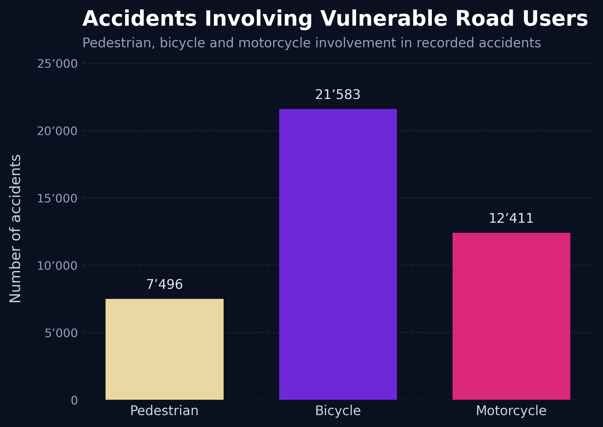
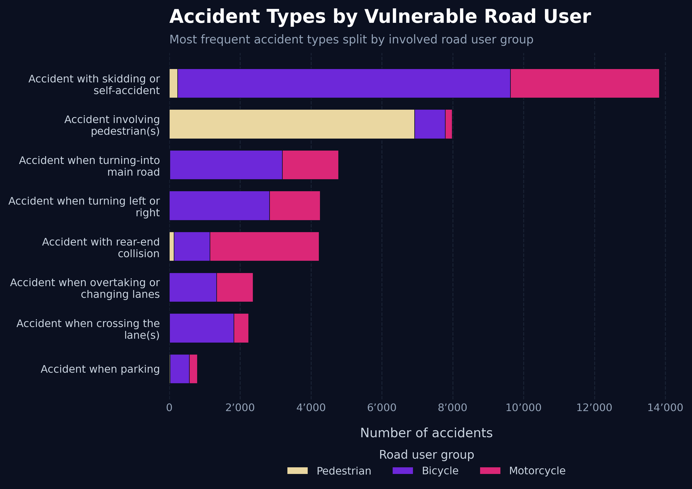
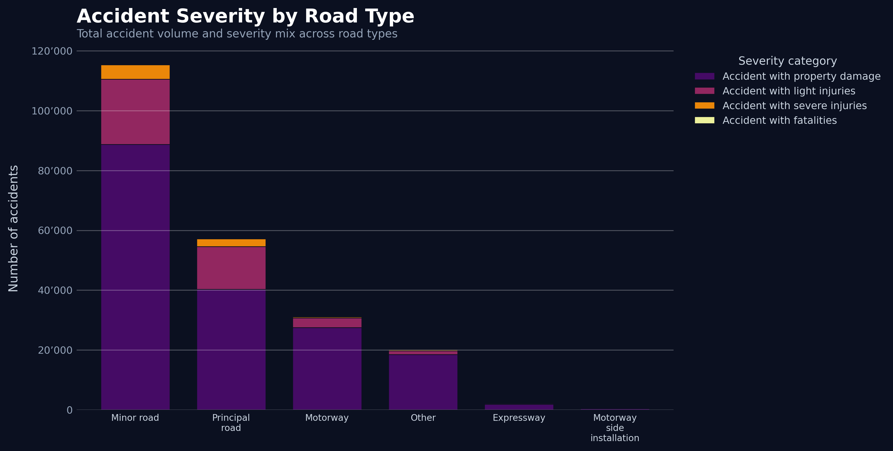
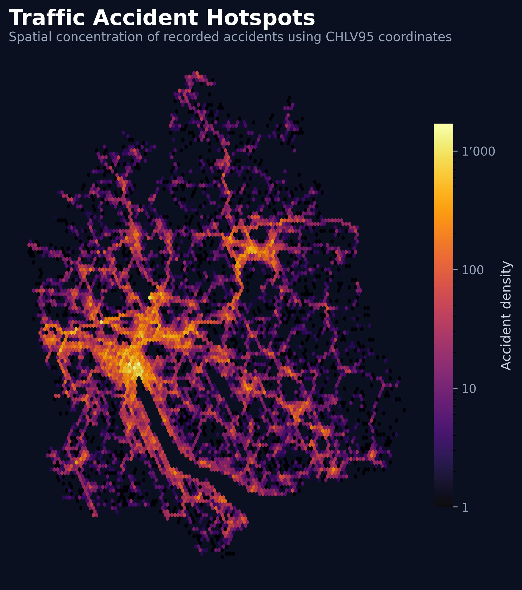

# Visualization Design Report

This report documents the visual encoding and design decisions made during the development of the visualization product. It translates the visualization concept outlined in the [Project Charta](project_charta.qmd) into concrete design specifications and documents the current dashboard prototype.

## Design Overview

The visualization product focuses on police-recorded road traffic accidents in the Canton of Zurich from 2011 to 2025. The goal is to help users understand temporal, categorical, severity-related, vulnerable road user and spatial accident patterns.

The current product is an interactive Streamlit dashboard supported by static prototype visualizations generated in Python. The dashboard is designed for two applied user groups: traffic police operations and insurance risk analysis. It supports exploratory analysis through filters, tooltips, drill-down views and a spatial hotspot view.

The visualizations aim to help users:

- identify temporal trends in accident frequency
- inspect monthly patterns for a selected year
- understand when accidents occur during the week
- compare vulnerable road user involvement
- compare frequent accident types by vulnerable road user group
- compare accident severity across road types
- identify spatial accident hotspots across the Canton of Zurich

## Data-to-Visual Mapping

The visualizations are based on the processed dataset described in the [Data Report](data_report.qmd). The processed dataset contains selected variables such as accident year, month, weekday, hour, accident type, severity category, road type, vulnerable road user involvement and accident coordinates.

: Data-to-visual mapping overview. {#tbl-encoding-overview}

| View / Chart | Data variables | Mark type | Visual channels | Scale |
|---|---|---|---|---|
| Yearly accident trend | `AccidentYear`, accident count | line, points | x-position, y-position, hover tooltip | temporal / linear |
| Monthly drill-down | `AccidentMonth`, accident count, selected year | line, points | x-position, y-position, hover tooltip | ordinal / linear |
| Weekday-hour heatmap | `AccidentWeekDay_en`, `AccidentHour`, accident count | cells | x-position, y-position, colour intensity | categorical / ordinal / linear |
| Vulnerable road user involvement | pedestrian, bicycle and motorcycle involvement variables | bars | x-position, bar height, colour category, value labels | categorical / linear |
| Accident types by vulnerable road user | `AccidentType_en`, vulnerable road user involvement variables, accident count | stacked horizontal bars | y-position, bar length, colour category | categorical / linear |
| Severity by road type | `RoadType_en`, `AccidentSeverityCategory_en`, accident count | stacked bars | x-position, bar height, colour category, hover tooltip | categorical / linear |
| Spatial accident hotspots | `AccidentLocation_CHLV95_E`, `AccidentLocation_CHLV95_N`, accident count | spatial density points / grid cells | x-position, y-position, colour intensity, zoom | spatial / logarithmic |

## Layout and Composition

The dashboard is organized as a scrollable analytical interface. The views are arranged from general overview to more specific analytical perspectives:

1. overall accident volume and key indicators
2. accident trend over time and monthly drill-down
3. weekday-hour accident patterns
4. vulnerable road user involvement and accident types
5. severity distribution by road type
6. spatial accident hotspots

This order supports a logical reading path. Users first understand the scale of the selected data, then inspect temporal patterns, then compare accident categories and vulnerable road users, and finally explore spatial concentration.

The dashboard uses a sidebar for filters. This keeps the main visual area focused on interpretation while still allowing users to refine the data by year, severity category, road type, accident type and vulnerable road user involvement.

## Interaction Design

The current visualization product includes implemented interactive features in Streamlit and Plotly.

Implemented interactions include:

- filtering by year range
- filtering by severity category
- filtering by road type
- filtering by accident type
- filtering by vulnerable road user involvement
- hover tooltips for detailed values
- monthly drill-down year selector
- legend interaction in stacked charts
- zooming in the spatial hotspot view
- multi-select hotspot focus options, such as severe injuries, fatal accidents, pedestrian involvement, bicycle involvement and motorcycle involvement

Most charts have zooming and panning disabled to keep the dashboard stable and easy to read. The spatial hotspot view is the exception, because zooming is useful for inspecting dense accident areas more closely.

The interaction design follows a dashboard logic rather than a full linked-view analytical system. Filters update all relevant views, but selections inside one chart do not dynamically filter the other charts.

## Visual Style and Aesthetics

The dashboard uses a consistent dark visual style. The main background colour is a very dark navy blue (`#0B1020`). Cards, sidebar elements and hover labels use a slightly lighter dark background (`#111827`). Grid lines and borders use muted blue-grey tones such as `#1E293B`.

The dark style supports visual focus and makes high-density areas, highlighted lines and categorical colour groups stand out. It also creates a consistent visual identity across the dashboard and the supporting static prototype visualizations.

The visual style follows these principles:

- clear section labels and descriptive chart titles
- short explanatory text instead of long paragraphs
- readable axis labels and value labels
- consistent dark background across charts
- warm accent colours for temporal trends
- categorical colours for vulnerable road user groups and severity levels
- colour gradients for frequency and spatial density
- hover tooltips for details-on-demand

Colour is used functionally:

- orange highlights the main time trend
- purple is used for the monthly drill-down
- beige, violet and pink distinguish pedestrian, bicycle and motorcycle involvement
- severity categories use a fixed categorical palette
- heatmap and hotspot views use colour intensity to represent frequency or density

## Prototype Description

The current product consists of an interactive Streamlit dashboard and supporting static prototype visualizations.

The dashboard is implemented in:

```text
app/streamlit_app.py
```

The supporting static prototype visualizations are generated in:

```text
data_acquisition/viz_design/01_visualizations.ipynb
```

The generated images are stored in:

```text
docs/pics/visualizations/
```

### Accident Trend Over Time

The yearly line chart shows the development of recorded traffic accidents over time. The line and markers make it easy to compare years and identify periods with higher or lower accident volume. In the dashboard, a monthly drill-down below the yearly view allows users to inspect seasonal variation for a selected year.

{#fig-accidents-time width=90%}

### Accidents by Weekday and Hour

The heatmap shows when accidents are most frequent during the week. It combines two temporal dimensions in one view: weekday and hour. Colour intensity represents accident frequency, making recurring daily or weekly patterns visible.

{#fig-accidents-weekday-hour width=90%}

### Accidents Involving Vulnerable Road Users

This bar chart compares how often pedestrians, bicycles and motorcycles are involved in recorded accidents. These road user groups are important for traffic safety planning because they are less protected in accidents than car occupants.

{#fig-vulnerable-users width=75%}

### Accident Types by Vulnerable Road User

This stacked horizontal bar chart compares frequent accident types and splits them by vulnerable road user group. It helps users understand whether certain accident types are more strongly associated with pedestrians, bicycles or motorcycles.

{#fig-types-vulnerable width=90%}

### Accident Severity by Road Type

This stacked bar chart compares both total accident volume and severity composition across different road types. Stacking makes it possible to see whether a road type has mainly property damage accidents or a higher share of injury-related outcomes.

{#fig-severity-road-type width=90%}

### Spatial Accident Hotspots

The spatial hotspot view shows accident concentration across the Canton of Zurich using CHLV95 coordinates. The colour intensity represents accident density. In the dashboard, users can zoom into this view and select hotspot focus categories such as severe injuries, fatal accidents or vulnerable road user involvement.

{#fig-accident-hotspots width=85%}

## Design Rationale and Iterations

The design process started with simple static charts because the first goal was to understand whether the processed dataset supported meaningful visual perspectives. Line charts, bar charts and heatmaps were chosen because they are familiar chart types and can be interpreted quickly by users with different levels of data literacy.

During later iterations, the project evolved from static prototype charts into an interactive Streamlit dashboard. This change was made because the target users benefit from filtering and exploration. Traffic police operations may need to focus on specific severities, road types or accident locations, while insurance risk analysts may need to compare accident exposure across categories and time periods.

The yearly accident trend was extended with a monthly drill-down because yearly values alone hide seasonal variation. The weekday-hour heatmap was kept because it efficiently combines two time dimensions in one compact view.

The previous separate fatal accident chart was removed from the final dashboard structure. Fatal accidents are still available through filters and hotspot focus options, but the final design avoids adding a separate chart that would duplicate information already available in the severity and hotspot views.

The vulnerable road user view was added because the processed dataset includes pedestrian, bicycle and motorcycle involvement variables. This addition makes the dashboard more relevant for traffic safety planning and insurance risk analysis.

A full web map was considered, but the dataset uses Swiss CHLV95 coordinates. Instead of requiring coordinate conversion and a basemap, the dashboard uses an interactive spatial hotspot view based directly on the available coordinates. This is sufficient to show concentration patterns while keeping implementation reproducible within the project timeline.

## Conclusions and Next Steps

The current visualization product confirms that the processed dataset supports several meaningful analytical perspectives. The Streamlit dashboard provides an interactive overview of temporal, categorical, vulnerable road user, severity-related and spatial accident patterns.

The next steps are:

- ensure consistent wording between the Project Charta, Data Report, Visualization Design Report and dashboard
- document the dashboard deployment process
- evaluate the dashboard with task-based questions
- refine explanatory text where necessary
- prepare the final Quarto website and Streamlit dashboard for online publication